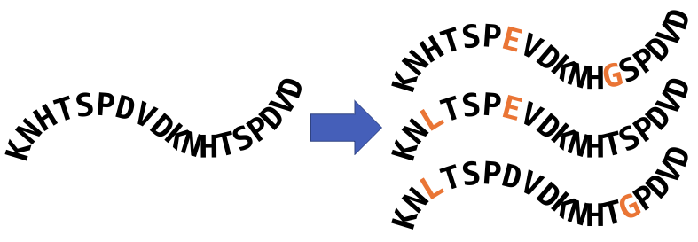
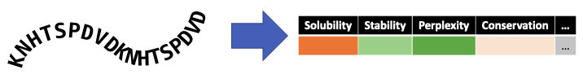
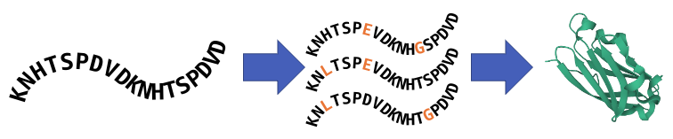

# Solutions for Protein Structure Analysis

## Summary
Knowing the physical structure of proteins is an important part of both small molecule and biologics drug R&D. Machine learning algorithms like DeepMind’s [AlphaFold](https://deepmind.com/blog/article/alphafold-a-solution-to-a-50-year-old-grand-challenge-in-biology) can significantly reduce the cost and time required to generate usable protein structures. These high-profile projects have inspired increased development of AI-driven workflows for protein structure prediction, de novo protein design, and protein-ligand interaction analysis. AWS pharmaceutical and life science customers believe that these in silico tools can help reduce the cost and time required to bring new therapeutics to market.

AWS technical teams have developed solutions to common protein structure problems. These use a variety of services to best fit the needs of our customers. 

## AWS Solutions by Analysis Type

### Sequence Homology Search

| Project            | Solution          |
| ------------------ | ----------------- |
| JackHMMER/HHBlits  | [AWS Batch](https://github.com/aws-samples/aws-batch-arch-for-protein-folding)

### Sequence Property Prediction

| Project            | Solution          |
| ------------------ | ----------------- |
| ProtBERT           | [Amazon SageMaker](https://aws.amazon.com/blogs/machine-learning/fine-tune-and-deploy-the-protbert-model-for-protein-classification-using-amazon-sagemaker/)  |

### MSA-Based Structure Prediction

| Project            | Solution          |
| ------------------ | ----------------- |
| RoseTTAFold        | [AWS Batch](https://github.com/aws-samples/aws-rosettafold)         |
| AlphaFold          | [AWS Batch](https://github.com/aws-samples/aws-batch-arch-for-protein-folding)         |
| AlphaFold-Multimer | [AWS Batch](https://github.com/aws-samples/aws-batch-arch-for-protein-folding)         |
| OpenFold           | [AWS Batch](https://github.com/aws-samples/aws-batch-arch-for-protein-folding)         |