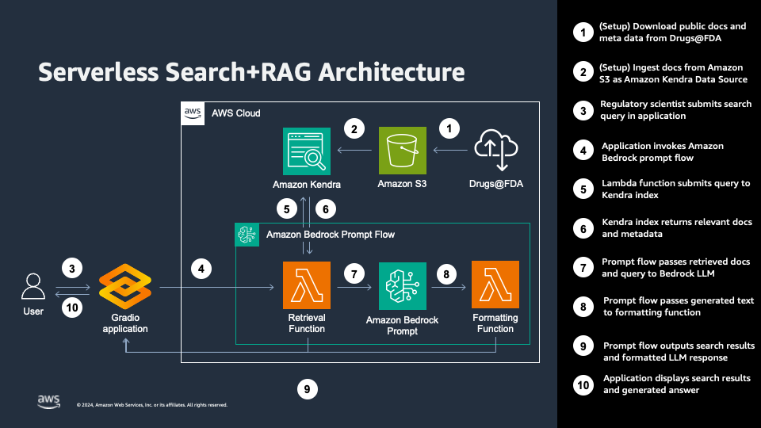

# Drugs@FDA Search Demo

## Summary

A Search + RAG demo using documents from the [Drugs@FDA](https://www.fda.gov/drugs/drug-approvals-and-databases/about-drugsfda) data source.

## Architecture

## Contents

This project includes four Jupyter notebooks that walk through the process of building a Search+RAG workflow for Drugs@FDA:

1. Load Drugs@FDA data and metadata into Amazon S3.
1. Create Kendra Index and Data Source.
1. Explore Search+RAG with Amazon Bedrock.
1. Build a Search+RAG pipeline with Bedrock Prompt Flows.

## Getting Started

1. Verify that you have programmatic credentials saved to access your AWS account.
1. Set an environment variable named `S3_BUCKET_NAME` with the name of an existing S3 bucket. You can also add this to a file named `.env` for easier management.
1. Run notebooks 1-4.
