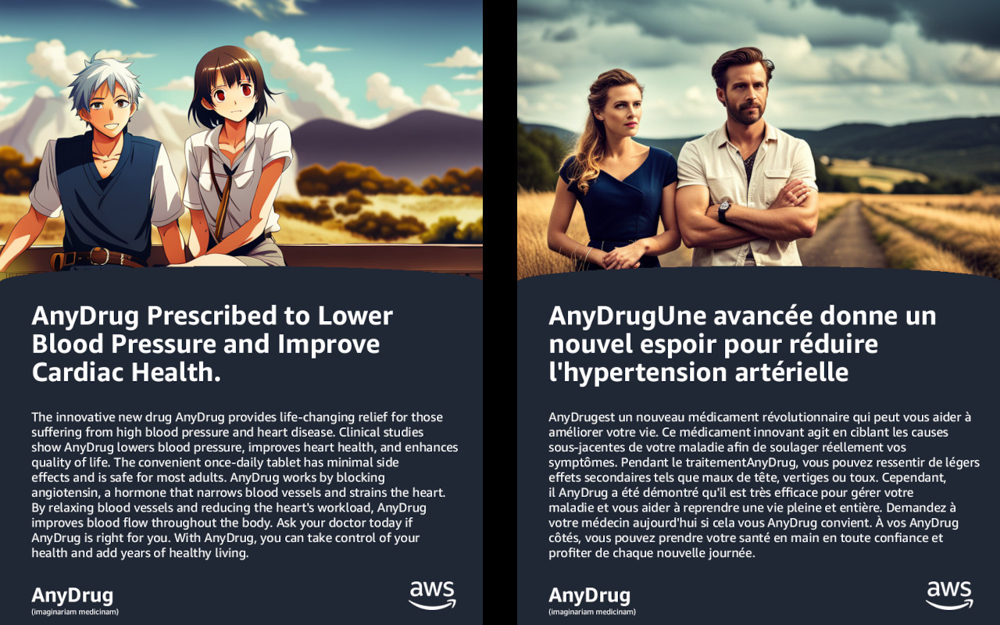
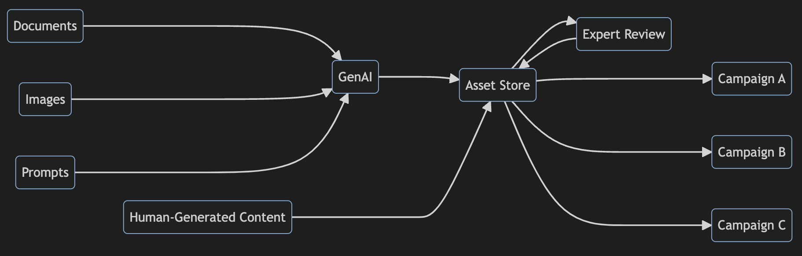

# Generate Localized Life Science Marketing Content with Amazon Bedrock

## 1. Table of Contents

1. [Table of Contents](#1-table-of-contents)  
2. [Customer Need](#2-customer-need)  
3. [Solution](#3-solution)  
3.1. [Workflow](#31-workflow)  
3.2. [Notebook Summaries](#32-notebook-summaries)  
4. [Service Details](#4-service-details)  
5. [Access](%5-access)

---

## 2. Customer Need

Life science companies need to reach ever-smaller groups of customers with tailored marketing content. However, it's expensive and time-consuming to manually create, review, and approve personalized content at scale. Generative AI has the potential to help. However, automated content generation must produce factual information that meets all regulatory requirements.

---

## 3. Solution

### 3.1. Workflow

### 3.2. Notebook Summary

1. Generate headline and body text from a product description using the Anthropic Claude model in Amazon Bedrock.
1. Generate stock images using the Stability.ai Stable Diffusion model in Amazon Bedrock.
1. Translate the marketing text using Amazon Translate and perform image-to-image transformation using Stable Diffusion in Amazon Bedrock.
1. Create multiple marketing campaign documents from the generated assets.

---

## 4. Service Details

### 4.1. Amazon Simple Storage Service (Amazon S3)

 [Amazon Simple Storage Service (Amazon S3)](https://aws.amazon.com/s3/) is an object storage service offering industry-leading scalability, data availability, security, and performance. Customers of all sizes and industries can store and protect any amount of data for virtually any use case, such as data lakes, cloud-native applications, and mobile apps. With cost-effective storage classes and easy-to-use management features, you can optimize costs, organize data, and configure fine-tuned access controls to meet specific business, organizational, and compliance requirements.

### 4.2. Amazon Bedrock

 [Amazon Bedrock](https://aws.amazon.com/bedrock/) is a fully managed service that makes FMs from leading AI startups and Amazon available via an API, so you can choose from a wide range of FMs to find the model that's best suited for your use case. With the Bedrock serverless experience, you can get started quickly, privately customize FMs with your own data, and easily integrate and deploy them into your applications using the AWS tools and capabilities you are familiar with (including integrations with Amazon SageMaker ML features such as Experiments to test different models and Pipelines to manage your FMs at scale) without having to manage any infrastructure.

### 4.3. Amazon Translate

[Amazon Translate](https://aws.amazon.com/translate/) is a neural machine translation service that delivers fast, high-quality, affordable, and customizable language translation.

---

## 5. Access

Please ensure that the IAM policy associated to your user/role has the following actions allowed:

* `bedrock.*`
* `s3.PutObject`
* `textract.StartDocumentAnalysis`
* `textract.GetDocumentAnalysis`
* `translate.TranslateText`
