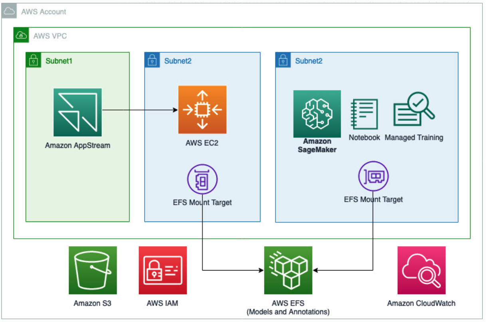

# Medical Imaging AI on AWS Workshop

## Introduction
Artificial Intelligence (AI) has been proven to be used to support radiologist clinical decision making and to help reduce doctor burnout. To apply AI in medical imaging diagnosis, we need vast amount of annotated medical images to develop a supervised AI model. Annotating medical images accurately is an important procedure. However, it is not only tedious and time consuming, but it also demands costly, specialty-oriented skills, which are not easily accessible. AI Assissted Annotations (AIAA) has been developed to largely reduce the manual process.

## Workshop Studio

More information about this workshop is available on [AWS Workshop Studio](https://catalog.us-east-1.prod.workshops.aws/workshops/ff6964ec-b880-45d4-bc1e-468b0c7fa854/en-US/).

## Architecture Overview
[This workshop](https://catalog.us-east-1.prod.workshops.aws/workshops/ff6964ec-b880-45d4-bc1e-468b0c7fa854/en-US/) presents an AWS solution by running open source [MONAI label](https://docs.monai.io/projects/label/en/latest/index.html) on EC2 virtual machine with autoscaling, which has been mounted to the same [Amazon Elastic File System (EFS)](https://aws.amazon.com/efs/) volume shared with [Amazon Sagemaker Studio notebook](https://docs.aws.amazon.com/sagemaker/latest/dg/notebooks.html) instances. Through the common file share, clinicians and data scientists can collaborate on the same data sets through different tools that they are familiar with. [Amazon AppStream 2.0](https://aws.amazon.com/appstream2/) is used to stream an image computing platform, named [3D Slicer](https://www.slicer.org/) for interactive medical image annotation for clinicians.

## Objectives
You will learn how to achieve AIAAs of medical images on AWS using MONAI Label through this workshop:

1. You will deploy and configure MONAI Label server on AWS
1. Radiologists will be able to perform medical image annotations using 3D Slicer on Amazon AppStream 2.0
1. Data scientists will be able to build Deep Learning model using annotated images on Amazon SageMaker notebooks

## Requirements

Get familiar with following AWS services:
- [Amazon AppStream 2.0](https://aws.amazon.com/appstream2/)
- [Amazon CloudFormation](https://aws.amazon.com/cloudformation/)
- [Amazon SageMaker](https://aws.amazon.com/pm/sagemaker)
- [Amazon EC2](https://aws.amazon.com/ec2/)
- [Amazon EFS](https://aws.amazon.com/efs/)

You will use the open source [3D Slicer image viewer](https://www.slicer.org/) to visualize and annotate images in [Medical Segmentation Decathlon](https://registry.opendata.aws/msd/).

## Cost Estimate

We’ve included a [cost estimate](https://calculator.aws/#/estimate?id=dfb2aa63e2eb7d53385c0290fb2602cc2d2e4630) for default compute and storage used in this workshop. You can modify the Amazon EC2 instance type and size on the AWS Pricing Calulator to the corresponding ones you selected to deploy this solution.

Note that the AWS Pricing Calulator estimates charges based on monthly and yearly intervals. If you’re only planning on using this workshop for a couple of hours, you can divide the “Total monthly” cost by 730 to get an approximate hourly running cost. For example, if the total monthly cost is $1167 then the hourly cost is $1167 ÷ 730 = $1.59 per hour.

## MONAI Label Tutorial

[https://youtu.be/m2rYorVwXk4](https://youtu.be/m2rYorVwXk4)