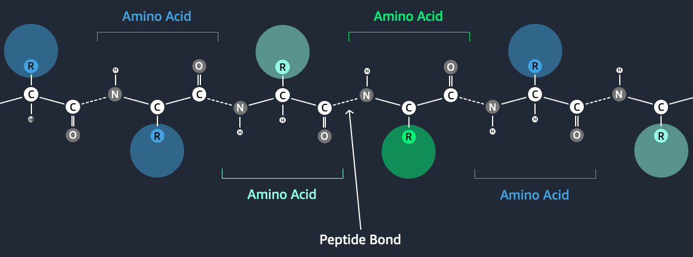

# Training Protein Language Models

## Overview

This project describes how to fine-tune the ESM-2 protein language model in Amazon SageMaker using Neuron, LoRA, distributed training, and other advanced LLM methods..

## FAQs

### What is a Protein?

Proteins are complex molecules that are essential for life. The shape and structure of a protein determines what it can do in the body. Knowing how a protein is folded and how it works helps scientists design drugs that target it. For example, if a protein causes disease, a drug might be made to block its function. The drug needs to fit into the protein like a key in a lock. Understanding the protein's molecular structure reveals where drugs can attach. This knowledge helps drive the discovery of innovative new drugs.

### What is a Protein Language Model?

Proteins are made up of linear chains of molecules called amino acids, each with its own chemical structure and properties. If we think of each amino acid in a protein like a word in a sentence, it becomes possible to analyze them using methods originally developed for analyzing human language. Scientists have trained these so-called, "Protein Language Models", or pLMs, on millions of protein sequences from thousands of organisms. With enough data, these models can begin to capture the underlying evolutionary relationships between different amino acid sequences.

It can take a lot of time and compute to train a pLM from scratch for a certain task. For example, a team at Tsinghua University [recently described](https://www.biorxiv.org/content/10.1101/2023.07.05.547496v3) training a 100 Billion-parameter pLM on 768 A100 GPUs for 164 days! Fortunately, in many cases we can save time and resources by adapting an existing pLM to our needs. This technique is called "fine-tuning" and also allows us to borrow advanced tools from other types of language modeling

### What is QLoRA?

One such method originally developed in 2021 for language analysis is ["Low-Rank Adaptation of Large Language Models"](https://www.biorxiv.org/content/10.1101/2023.07.05.547496v3), or "LoRA". This method adapts large pre-trained language models to new tasks. It does this by changing only a small part of the model. This makes the method very efficient. The small changed part targets the most important information needed for the new task. This allows quick customization of the model for new uses.

The "Q" in "QLoRA" stands for "Quantization", a way of reducing the the precision of weights and activations in a neural network model to use fewer bits. This makes the model smaller and faster. The QLoRA method was described in ["QLoRA: Efficient Finetuning of Quantized LLMs"](https://huggingface.co/papers/2305.14314), a paper published by the [HuggingFace H4 team](https://huggingface.co/HuggingFaceH4) in early 2023.

LoRA + quantization enables us to use less GPU memory (VRAM) to train large language models, giving us more compute flexibility.

### What is ESM-2?

[ESM-2](https://www.biorxiv.org/content/10.1101/2022.07.20.500902v1) is a pLM trained using unsupervied masked language modelling on 250 Million protein sequences by researchers at [Facebook AI Research (FAIR)](https://www.biorxiv.org/content/10.1101/2022.07.20.500902v1). It is available in several sizes, ranging from 8 Million to 15 Billion parameters. The smaller models are suitable for various sequence and token classification tasks. The FAIR team also adapted the 3 Billion parameter version into the ESMFold protein structure prediction algorithm. They have since used ESMFold to predict the struture of [more than 700 Million metagenomic proteins](https://esmatlas.com/about). 

ESM-2 is a powerful pLM. However, it has traditionally required multiple A100 GPU chips to fine-tune. In this notebook, we demonstrate how to use QLoRA to fine-tune ESM-2 in on an inexpensive Amazon SageMaker training instance. We will use ESM-2 to predict [subcellular localization](https://academic.oup.com/nar/article/50/W1/W228/6576357). Understanding where proteins appear in cells can help us understand their role in disease and find new drug targets.
