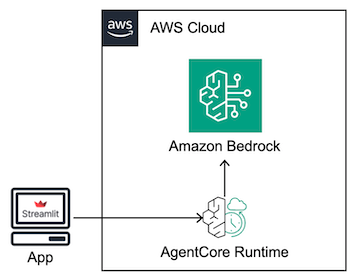

# Bedrock AgentCore Chat Interface

A Streamlit web application for interacting with AI agents deployed on Amazon Bedrock AgentCore Runtime. This application provides an intuitive chat interface to communicate with your deployed agents in real-time.

## About Amazon Bedrock AgentCore

Amazon Bedrock AgentCore is a comprehensive service that enables you to deploy and operate highly effective AI agents securely at scale using any framework and model. AgentCore Runtime is a secure, serverless runtime purpose-built for deploying and scaling dynamic AI agents and tools using popular open-source frameworks like LangGraph, CrewAI, and Strands Agents.

## Features

- **Real-time Chat Interface**: Interactive chat with deployed AgentCore agents
- **Agent Discovery**: Automatically discover and select from available agents in your AWS account
- **Version Management**: Choose specific versions of your deployed agents
- **Multi-Region Support**: Connect to agents deployed in different AWS regions
- **Streaming Responses**: Real-time streaming of agent responses
- **Response Formatting**: Auto-format responses with options to view raw output
- **Session Management**: Maintain conversation context with unique session IDs
- **Tool Visibility**: Optional display of tools used by agents during execution
- **Thinking Process**: Optional display of agent reasoning (when available)

## Architecture



## Prerequisites

- Python 3.11 or higher
- [uv package manager](https://docs.astral.sh/uv/getting-started/installation/)
- AWS CLI configured with appropriate credentials
- Access to Amazon Bedrock AgentCore service
- Deployed agents on Bedrock AgentCore Runtime

### Required AWS Permissions

Your AWS credentials need the following permissions:

- `bedrock-agentcore-control:ListAgentRuntimes`
- `bedrock-agentcore-control:ListAgentRuntimeVersions`
- `bedrock-agentcore:InvokeAgentRuntime`

## Installation

1. **Clone the repository**:

   ```bash
   git clone https://github.com/awslabs/amazon-bedrock-agentcore-samples.git
   cd amazon-bedrock-agentcore-samples/03-integrations/ux-examples/streamlit-chat
   ```

2. **Install dependencies using uv**:

   ```bash
   uv sync
   ```

## (Optional) Deploy the Example Agent

1. **Install dev dependencies using uv** (recommended):

```bash
uv sync --dev
```

2. **Configure the agent**:

```bash
cd example
uv run agentcore configure -e agent.py
```

3. **Deploy to AgentCore Runtime**:

```bash
uv run agentcore launch
cd ..
```

## Running the Application

### Using uv (recommended)

```bash
uv run streamlit run app.py
```

The application will start and be available at `http://localhost:8501`.

## Usage

1. **Configure AWS Region**: Select your preferred AWS region from the sidebar
2. **Select Agent**: Choose from automatically discovered agents in your account
3. **Choose Version**: Select the specific version of your agent to use
4. **Start Chatting**: Type your message in the chat input and press Enter

### Configuration Options

- **Auto-format responses**: Clean and format agent responses for better readability
- **Show raw response**: Display the unprocessed response from the agent
- **Show tools**: Display when agents use tools during execution
- **Show thinking**: Display agent reasoning process (when available)
- **Session Management**: Generate new session IDs to start fresh conversations

## Project Structure

```
streamlit-chat/
├── app.py                    # Main Streamlit application
├── example.py                # Example agent
├── static/                   # UI assets (fonts, icons, logos)
├── pyproject.toml            # Project dependencies
└── README.md                 # This file
```

## Configuration Files

- **`pyproject.toml`**: Defines project dependencies and metadata
- **`.streamlit/config.toml`**: Streamlit-specific configuration

## Troubleshooting

### Common Issues

1. **No agents found**: Ensure you have deployed agents in the selected region and have proper AWS permissions
2. **Connection errors**: Verify your AWS credentials and network connectivity
3. **Permission denied**: Check that your IAM user/role has the required Bedrock AgentCore permissions

### Debug Mode

Enable debug logging by setting the Streamlit logger level in the application or check the browser console for additional error information.

## Development

### Adding New Features

The application is built with modularity in mind. Key areas for extension:

- **Response Processing**: Modify `clean_response_text()` for custom formatting
- **Agent Selection**: Extend `fetch_agent_runtimes()` for custom filtering
- **UI Components**: Add new Streamlit components in the sidebar or main area

### Dependencies

- **boto3**: AWS SDK for Python
- **streamlit**: Web application framework
- **uv**: Fast Python package installer and resolver

## Contributing

1. Fork the repository
2. Create a feature branch
3. Make your changes
4. Test thoroughly
5. Submit a pull request

## License

This project is licensed under the terms specified in the repository license file.

## Resources

- [Amazon Bedrock AgentCore Documentation](https://docs.aws.amazon.com/bedrock-agentcore/)
- [Bedrock AgentCore Samples](https://github.com/awslabs/amazon-bedrock-agentcore-samples/)
- [Streamlit Documentation](https://docs.streamlit.io/)
- [Strands Agents Framework](https://github.com/awslabs/strands-agents)
